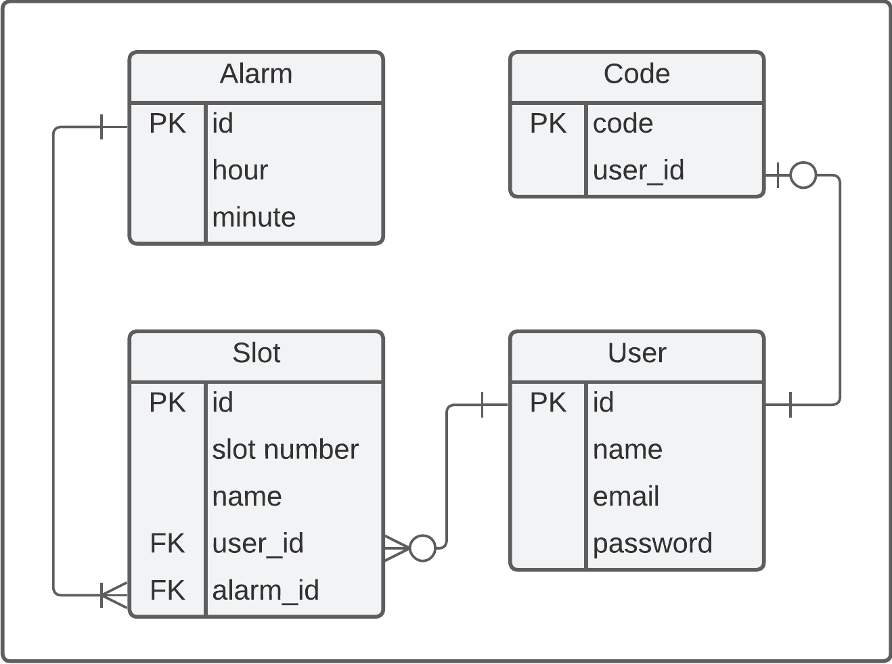

# Smart Pillbox API
API do projeto Porta Medicamentos Inteligente, desenvolvido para a disciplina de Projeto Integrado de Computação 2 (PIC2) do curso de Engenharia de Computação da Universidade Federal do Espírito Santo (UFES).


# 1. Descrição

Desenvolvida em Java em conjunto com o framework Spring Boot, a API tem como objetivo ser um intermediário para a comunicação entre o aplicativo mobile, a placa NodeMCU ESP8266, que controla o hardware do projeto. A API é integrada com o banco de dados PostgreSQL, que armazena as informações dos usuários e dos alarmes cadastrados.

O banco é estruturado da seguinte forma:



## 1.1. Tecnologias utilizadas:
- Java
- Spring Boot
- Maven
- PostgreSQL

## 1.2. Funcionalidades:
- Cadastro de usuário
- Login de usuário
- Vinculação de usuário com o porta medicamentos/esp8266
- Cadastro de alarmes
- Listagem de alarmes

# 2. Rotas:
## 2.1. Rotas acessadas pelo aplicativo mobile:

### POST `/api/v1/auth/register`:

  - **Descrição:** Cadastra um novo usuário no banco de dados.
    
  - **Body:**
    ```json
      {
          "name": "string",
          "email": "string",
          "password": "string"
      }
      ```
  - **Retorno:**
    - **Status:** 201
    
### POST `/api/v1/auth/authenticate`:

- **Descrição:** Caso o email e a senha informados sejam válidos retorna um token JWT que servirá para acessar as rotas protegidas da API (basta incluir token no header `Authorization`).

- **Body:**
  ```json
    {
        "email": "string",
        "password": "string"
    }
    ```
- **Retorno:**
  - **Status:** 200
  ```json
    {
      "token": integer
    }
    ``` 
 
### POST `/code/associate`:
- **Descrição:** Vincula um usuário a um porta medicamentos. O usuário deve estar autenticado para acessar essa rota.
- **Body:**
  ```json
    {
        "code": integer
    }
    ```
- **Retorno:**
  - **Status:** 200

### POST `/code/disassociate`:
- **Descrição:** Desvincula um usuário de um porta medicamentos. O usuário deve estar autenticado para acessar essa rota.
- **Body:** *vazio*
- **Retorno:**
  - **Status:** 200

### GET `/user`:
- **Descrição:** Retorna os dados do usuário autenticado. O usuário deve estar autenticado para acessar essa rota.
- **Body:** *vazio*
- **Retorno:**
  - **Status:** 200
  ```json
     {
          "name": "string",
          "email": "string",
          "associatedPillbox": "string"
     }
    ```

### POST `/config/app`:

- **Descrição:** Cria ou atualiza alarmes no banco de dados. O usuário deve estar autenticado para acessar essa rota.
- **Body:**
  ```json
    {
        "slots": {
            "S1": {
                "name": "medicamento1",
                "alarms": [
                    {
                        "hour": 9,
                        "minute": 30
                    },
                    {
                        "hour": 20,
                        "minute": 0
                    }
                ]
            },
            "S2": {
                "name": "medicamento2",
                "alarms": []
            },
            "S3": {
                "name": "medicamento3",
                "alarms": []
            },
            "S4": {
                "name": "medicamento4",
                "alarms": []
            },
            "S5": {
                "name": "medicamento5",
                "alarms": []
            }
        }
    }
    ```
- **Retorno:** 
  - **Status:** 200

### GET `/config/app`:

- **Descrição:** Retorna os alarmes cadastrados no banco de dados. O usuário deve estar autenticado para acessar essa rota.
- **Body:** *vazio*
- **Retorno:**
  - **Status:** 200
  ```json
  {
      "slots": {
          "S1": {
              "name": "medicamento1",
              "alarms": [
                  {
                      "hour": 9,
                      "minute": 30
                  },
                  {
                      "hour": 20,
                      "minute": 0
                  }
              ]
          },
          "S2": {
              "name": "medicamento2",
              "alarms": []
          },
          "S3": {
              "name": "medicamento3",
              "alarms": []
          },
          "S4": {
              "name": "medicamento4",
              "alarms": []
          },
          "S5": {
              "name": "medicamento5",
              "alarms": []
          }
      }
  }
    ```


## 2.2. Rotas acessadas pela placa NodeMCU ESP8266:

### GET `/code/get`:

- **Descrição:** Retorna o código de identificação do porta medicamentos. O código é gerado automaticamente pelo sistema e é único para cada porta medicamentos. O código é utilizado para vincular o porta medicamentos a um usuário.
- **Body:** *vazio*
- **Retorno:**
  - **Status:** 200
  ```json
    {
        "code": integer
    }
    ```

### GET `/code/get/token`:

- **Descrição:** Retorna token JWT caso exista um usuário vinculado ao porta medicamentos. O token é utilizado para autenticar o porta medicamentos no sistema.
- **Body:** *vazio*
- **Retorno:**
  - **Status:** 200
  ```json
    {
        "token": integer
    }
    ```
### GET `/config:`:

- **Descrição:** Retorna os alarmes cadastrados no banco de dados. O usuário deve estar autenticado para acessar essa rota.
- **Body:** *vazio*
- **Retorno:**
  - **Status:** 200
  ```json
  {
      "slots": {
          "S1": "medicamento1",
          "S2": "medicamento2",
          "S3": "medicamento3",
          "S4": "medicamento4",
          "S5": "medicamento5"
      },
      "alarms": [
          {
              "hour": 9,
              "minute": 30,
              "slots": [ "S1" ]
          },
          {
              "hour": 20,
              "minute": 0,
              "slots": [ "S1" ]
          }
      ]
  }
    ```

# 3. Como testar:

A API está hospedada no Heroku e pode ser acessada em: https://smart-pillbox-3609ac92dfe8.herokuapp.com

Para testar as rotas:

[](https://app.getpostman.com/run-collection/19094483-e687ccbe-5c82-48b6-83fa-d8d59f41a728?action=collection%2Ffork&collection-url=entityId%3D19094483-e687ccbe-5c82-48b6-83fa-d8d59f41a728%26entityType%3Dcollection%26workspaceId%3Da5f963fc-7a34-4fef-9e47-31af707eeaf6)


